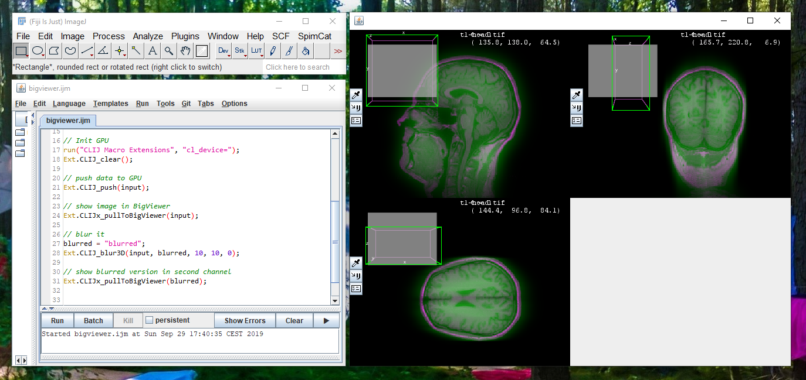

## CLIJ BigViewer
This [CLIJ](https://clij.github.io) plugin enables viewing images in the [BigDataViewer](https://imagej.net/BigDataViewer)

Right now, this is very preliminary.

## Installation intructions
Download Fiji and activate the `clij` update site as described [here](https://clij.github.io/clij-docs/installationInFiji). 
Furthermore, add another update site `clij2` with the url `https://sites.imagej.net/clij2/`.
Update Fiji and restart it.

## Code examples
Have a look in the [macros](https://github.com/clij/clij-bdv/tree/master/src/main/macro) folder.

Read more on the [CLIJ Website](https://clij.github.io).
